## Table of Contents

- [Summary](#summary)
- [Terminology](#termology)
  - [Material Physical Dimensions (Substance Painter)](#material-physical-dimensions-substance-printer)
  - [Invalid UV Islands](#invalid-uv-islands)
  - [Valid UV Islands](#valid-uv-islands)
  - [What Is a UV Island?](#what-is-a-uv-island)
- [Installation](#installation)
- [Usagage](#usagage)
- [Projects Purpose and Motivation](#projects-purpose-and-motivation)
- [Understanding the Point and Problem This Addon Solves](#understanding-the-point-and-problem-this-addon-solves)
  - [Keeping the UVs All Connected (One Big UV Island)](#keeping-the-uvs-all-connected-one-big-uv-island)
  - [Lazily Collapsing All UV Faces](#lazily-callapsing-all-uv-faces)
  - [Alignment Solution](#alignment-solution)

## Summary

This repository contains a simple Blender Python addon for three UV operations: Separation, Seamless Alignment, and Grid Alignment. UV Seamless Alignment requires knowing your texture's physical size, which Substance Printer allows you to set.

## Termology

### Material Physical Dimensions (Substance Printer)

When I talk about the material's physical dimensions, I'm referring to the settings in the Substance Printer. I won’t go into detail about it since documentation already exists. For example, this is a texture with multiple materials of different sizes.

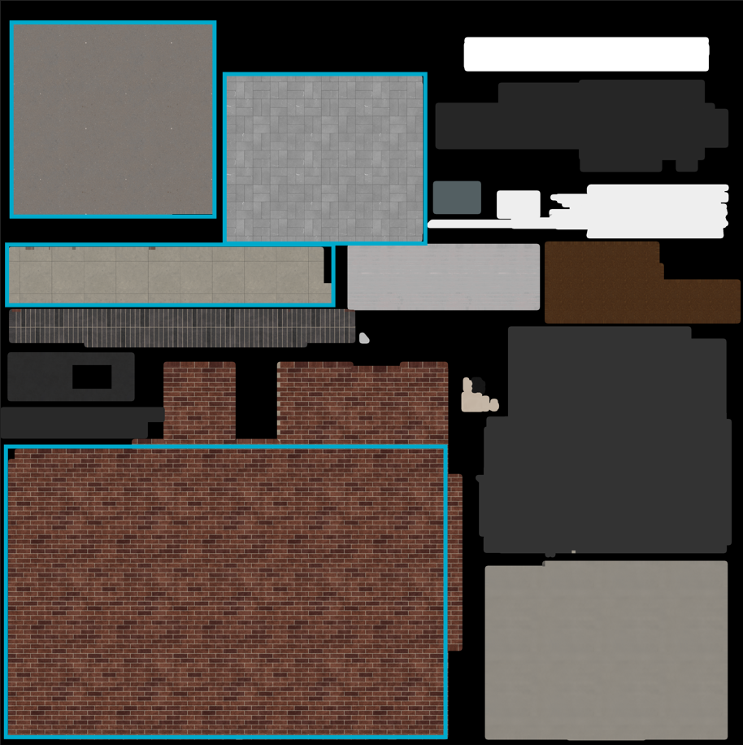

Here, I’ve highlighted three materials with different physical dimensions. This means that as you use the UV alignment and place the UV in its respective spot, you will have to adjust the material length and height in the ‘UV Seamless Alignment’ section, depending on which part of the asset you’re working on.

### Invalid UV Islands

UV faces that are not quads or have an irregular shape or alignment.

  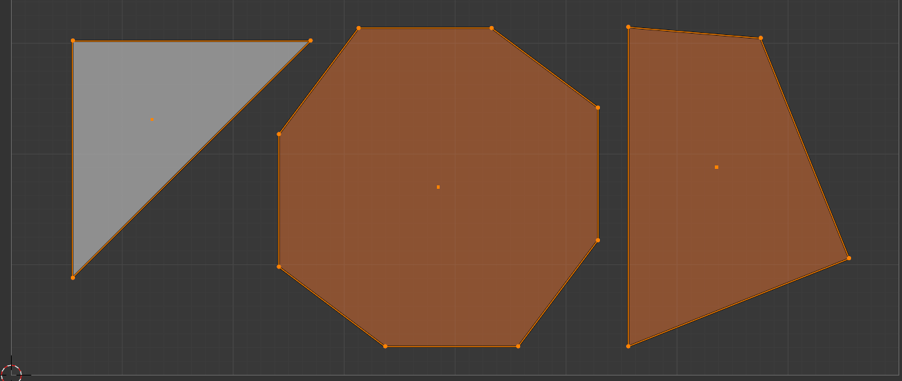

The UV Island below is invalid because the two faces correspond to faces in the 3D view that are not on the same axis plane. While this would not be a problem if the two faces were on the inside of the island, because they sit on the outside edges of the island, this will mess up the calculation.

  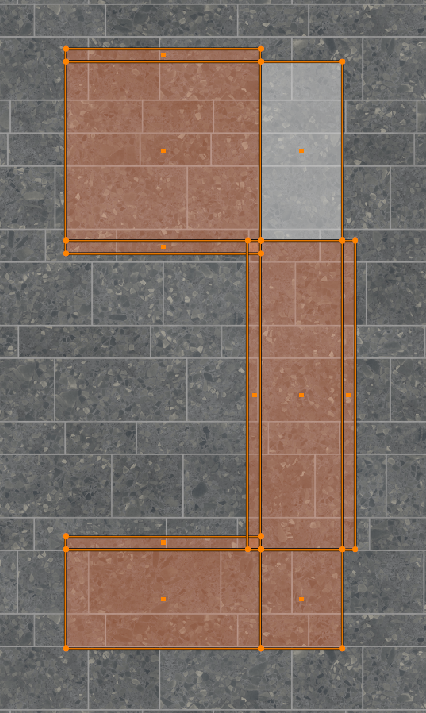
  

> To further understand, a simple bounding box that determines the width and height of the Island is calculated from the min and max x and y values. This means the two highlighted faces in the image create an incorrect bounding box for the given plane axis. I have some proof-of-concept fixes to address this in the future. As for now, it’s a limitation, which is why the separate UVs option may not work for your mesh.

### Valid UV Islands

UV faces that are regular, rectangular, and non-irregular. Note, the two UV islands in the second image are faces that point in a different direction in the 3D view (the face lay on a different axis plane) and while this was invalid in the first example, it is valid in this case because they are NOT on the outwards of the island but with in the UV island max and min x and y (UV coordinates) values meaning they will not affect the bounding box calculation.

### What is a UV Island?

A ‘UV Island’ is a group of UVs that touch or overlap, determined by ‘Merge Threshold’ in the ‘UV Seamless Alignment’ section. A single UV face is an island. This applies only to selected UV faces.

## Installation

Simply download the zip file and install it the same way you would for any other addon by going to Edit → Preferences → Add-ons and selecting ‘Install from Disk...’ and choosing the downloaded zip file.

## Usagage

Before starting, make sure you know the most important thing: your material physical dimensions. This is needed for proper calculation. As mentioned above, this is a feature Substrance Painter allows you to set. We will use this in Step 3. Also, make sure you have ‘UV Sync Selection’ turned on; it's in the upper-left corner. It’s the icon with two diagonal arrows, side by side and pointing in opposite directions.

1. First, unwrap your asset.

  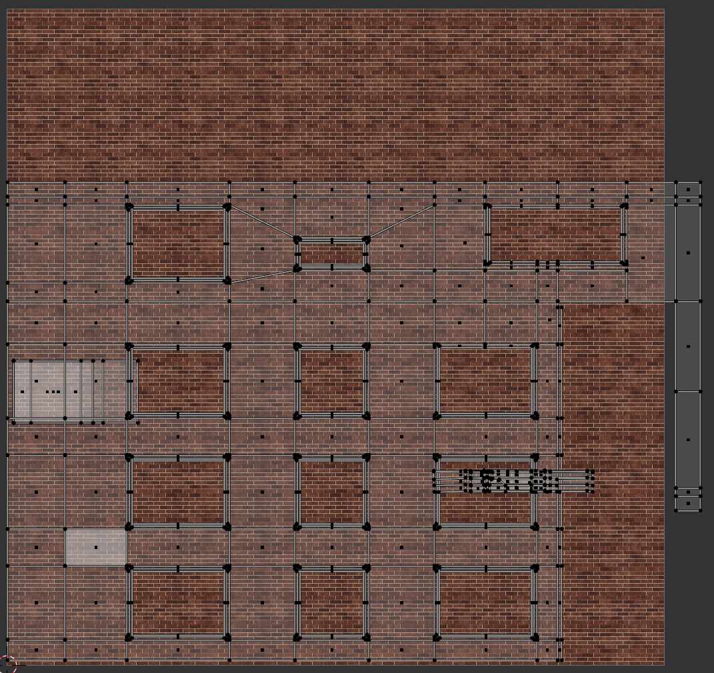

2. Now separate your UVs into valid UV Islands. Depending on how complex the mesh is, you may need to do this manually, or you might be able to use the UV Separation. When separating, separate only one axis at a time. This means that if you are doing manual separation, lock the axis to one at a time by pressing either the x or y key when moving the UV Island. I have the best luck with horizontal first, so I will do that one first.

  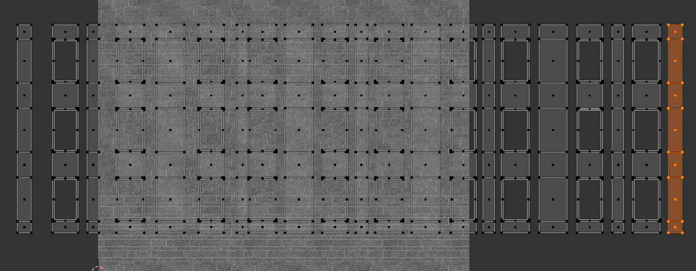
  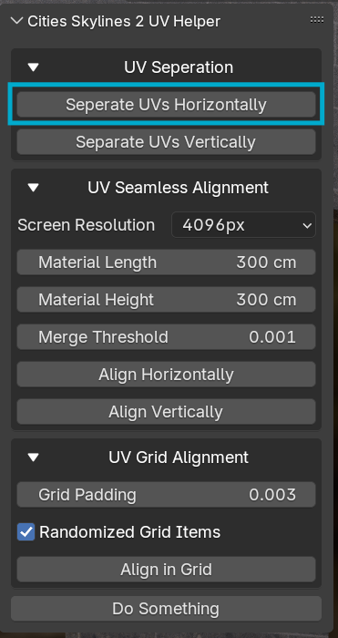

3. Now set the ‘Screen Resolution’ to the texture size and both the ‘Material Length’ and Material Height’ to the actual dimensions of the material (set in Substance Printer). In my case, I’m working with a 4k brick texture that repeats every 300 cm in both directions. You may need to adjust the ‘Merge Threshold’.

  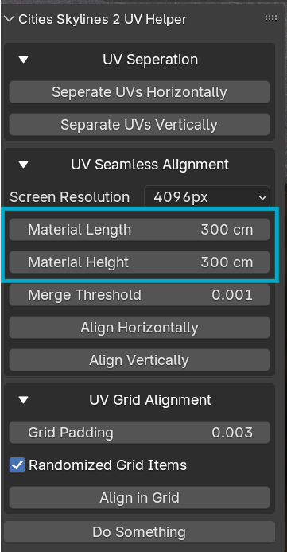

4. Now repeat steps 2 and 3. In my case, I would now do the vertical UV separation (step 3) and then the vertical alignment (step 4).

## Project’s Purpose and Motivation

This project started as a very simple method for compacting UVs during asset creation in “Cities Skylines II” (which I will refer to as CS2 going forward), a city-building game that lets you create and share assets. One requirement for UV wrapping your asset is that UVs cannot extend beyond UV space. 

In many projects, leaving the UV space causes the texture to repeat. However, in CS2, using outside UV space breaks the asset. 

## Understanding the point and problem this addon solves

### Keeping the UVs All Connected (One Big UV Island)

Imagine you are unwrapping a UV texture, which means flattening a 3D model's surface into a 2D map to apply images, on a large asset, such as a building. Here is what you might do.

  
  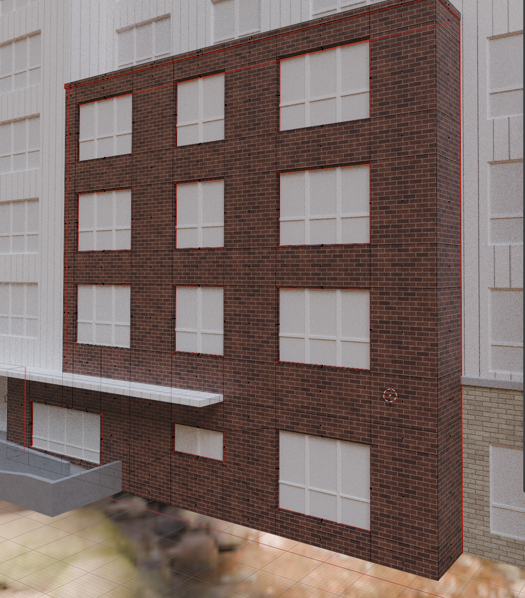

Here we unwrap the UVs, and for my personal use, I have also set the pixel density to be 2.56 px/cm (You do not need to know the pixel density; it is calculated internally to determine proper alignment). Now this texture is a 4k image that repeats every 2 meters by 2 meters. With a texture density of 2.56 px/cm, this means that if we keep the majority of our assets at that texture density, we have 16 meters by 16 meters of texture space. The building's surface exceeds 16 meters by 16 meters. As we can see, the UVs are simply too large; they extend beyond the space (not allowed in CS2), and lowering the texture density will result in a blurrier texture.

### Lazily Callapsing All UV Faces

Another option we could go with is to collapse all UVs so they overlap. This looks like this.

  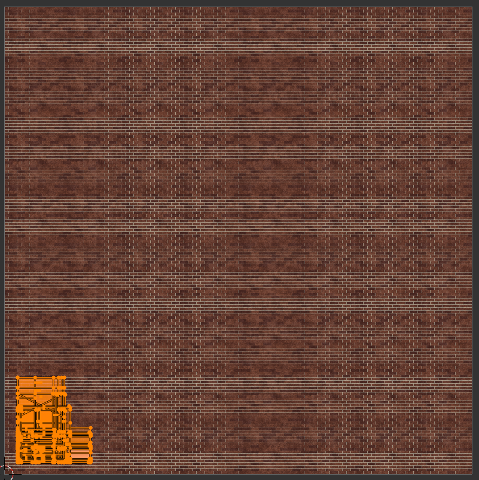
  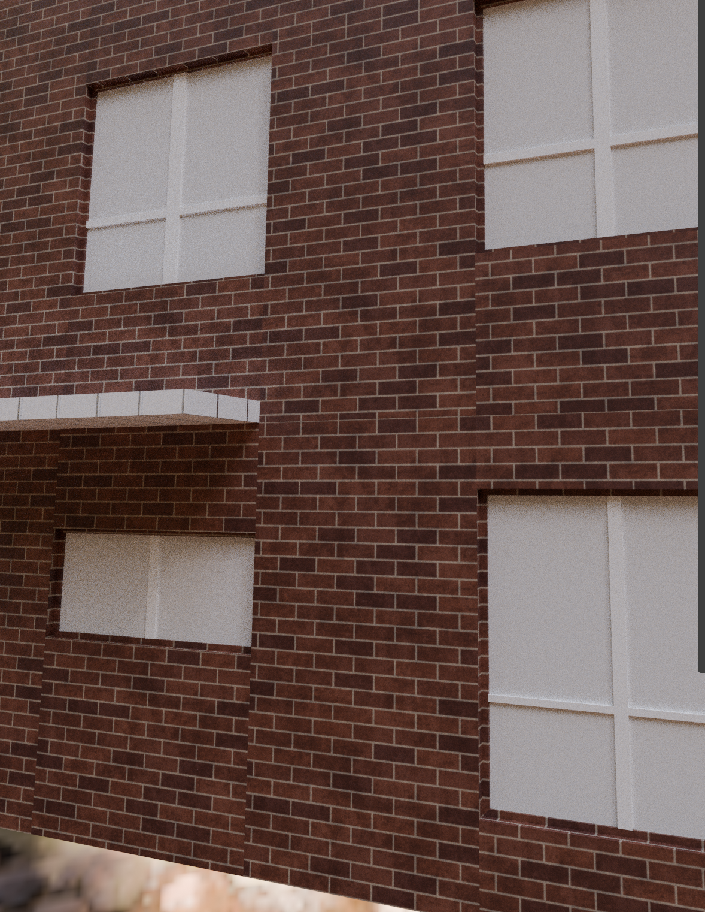

While this takes up less space, allowing us to easily fit all the UVs, the result in the 3D view is horrible; we can see tons of seams in the texture. By the way, there are assets from the game that have seams (just not as bad as this example). While minimal seams look fine from afar and are usually fine in a game like CS2, I find it a little ugly up close, so let's do better than the actual assets in the game. Now, you could custom-create every texture and design the assets in a modular way (a very good way to design buildings, since most buildings are modular in nature), so they snap together with no seams. However, these are CS2 assets that are meant to be viewed from a bird 's-eye view, not GTA 5 graphics. While some seams are fine, we want to eliminate as many seams as possible.

### Alignment Solution

This is where the alignment solution comes in. In the image below, we can see something similar: UVs are overlapped; however, in the 3D view, you see no seams (visible lines in texture caused by shifting UVs). This is because UV Seamless Alignment aligns the UV to minimize seams. NOTE: I originally made this software for myself with the attitude of good-enoughism (yes, I’m aware that enoughism isn’t a word). This means the program has limitations and cannot eliminate all seams in all situations.

  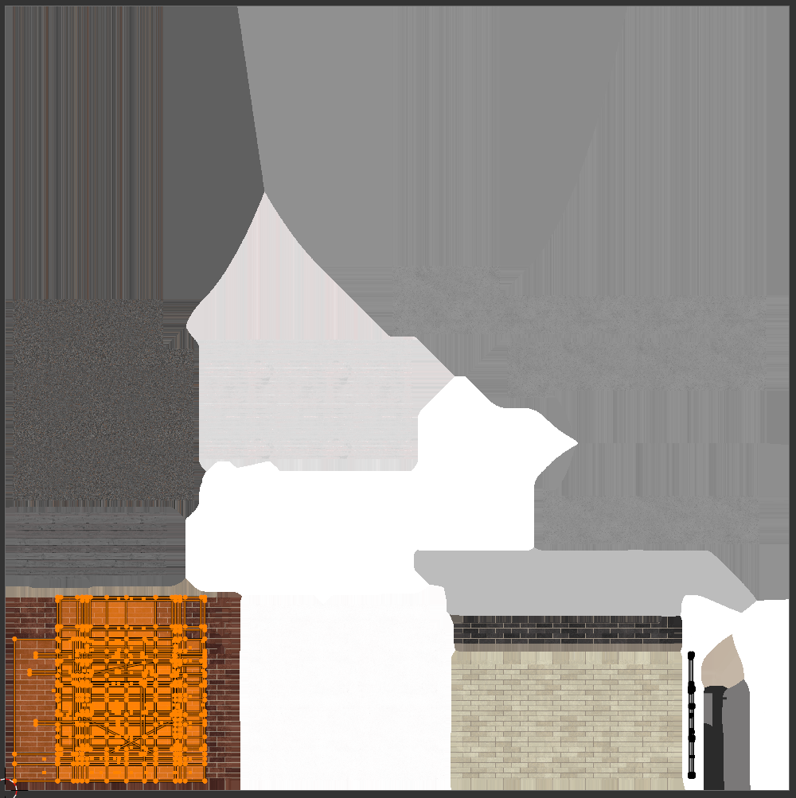
  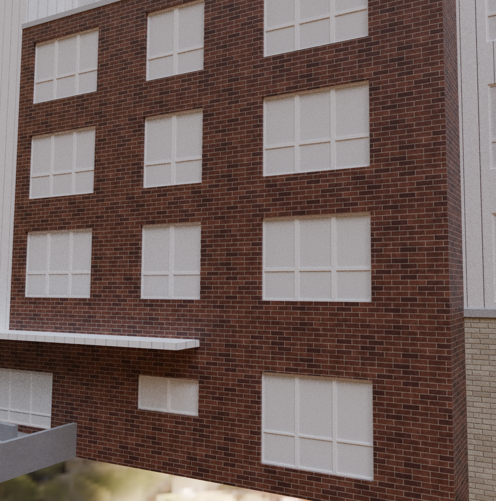

In fact, by being smart with our UVs, we can create an entire texture with multiple materials of different sizes that fit the entire build’s UVs.

Here, we are looking at an entire building, and its UVs fit onto a 4k texture with an average texture density of 2.56 px/cm, which means the area is 16x16 meters. Despite this, we only needed to use about half the texture. Even better, because this image contains large areas that aren't used (the solid colors generated by Substance Painter; you can fix this in Substance Painter), we can leverage compression. This entire 4k image (the CS2 guide states to use 4k for large assets, I believe, because of how the virtual texture thing works) takes up about 7.2 MB. To put this into comparison, the 4k texture of just the brick material by itself takes up 66.4 MB.

  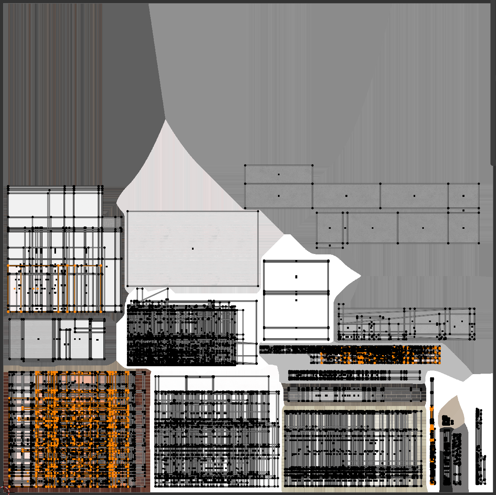
  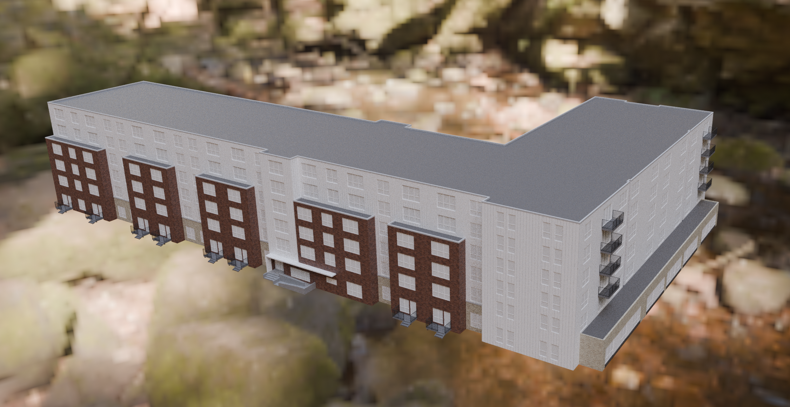

